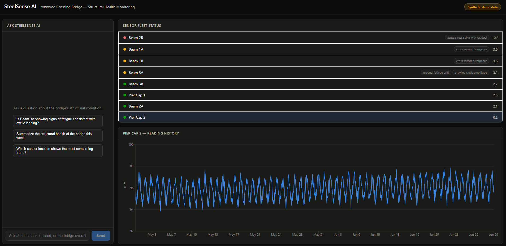
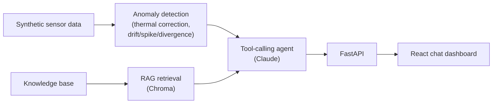

# SteelSense AI

An LLM-powered diagnostic assistant for structural health monitoring data from
magnetic/Hall-effect stress sensors — grounded in a curated domain knowledge base
via RAG, reasoning with tool-calling over a real (if small) anomaly-detection
pipeline, and answering natural-language questions through a chat dashboard.

> **This is a personal portfolio project, not a production system.** All sensor
> data is synthetically generated for a fictional bridge — see **Honest scope
> note** below before reading any further.

## Why this exists

I'm an Electrical & Computer Engineer (PhD, NTUA) whose doctoral research was on
magnetic sensor development for structural stress measurement, published in *IEEE
Transactions on Magnetics* and *Micromachines*. SteelSense AI applies LLM-based
agentic reasoning to that same domain — magnetic sensing, fatigue analysis, and
structural health monitoring — as a personal exploration of applied AI engineering:
RAG, tool-calling agents, a real (if simple) data/analysis pipeline, and evals,
connected to a technical area I already know well enough to judge whether the AI
layer is actually adding value or just talking.

## Screenshot



*Fleet status ranked by concern score, with a time-series chart shading detected
spike/drift windows. See the chat panel in action in
[docs/evals.md](docs/evals.md), or run it locally (below) to try it yourself.*

## Features

1. **Synthetic sensor data generator** — 60 days of hourly readings across 8
   sensor locations on a fictional bridge, with one of each anomaly type
   deliberately injected: gradual fatigue drift, an acute stress spike, and
   cross-sensor divergence. Clearly labeled synthetic throughout.
2. **Anomaly-detection pipeline** — per-sensor thermal correction, then drift,
   growing-cyclic-amplitude, spike, and cross-sensor-divergence detection, all
   expressed as structured findings (not raw signal dumps) the agent can reason
   over.
3. **RAG knowledge base** — 8 original, hand-written summaries of magnetic
   sensing principles, steel fatigue mechanics, and SHM practice, retrieved via a
   Chroma vector store to ground the agent's explanations.
4. **Tool-calling agent** — Claude (`claude-opus-5` by default), with tools to
   query sensor data, run the detection pipeline, and search the knowledge base,
   composing a grounded natural-language answer. Backed by a 10-query eval set
   graded by an independent judge model — see [`docs/evals.md`](docs/evals.md).
5. **Chat dashboard UI** — a React + recharts frontend: a chat panel alongside a
   sensor fleet-status view and a time-series chart that visually highlights
   detected anomalies (shaded spike/drift windows, an overlaid peer-sensor line
   for divergence).

See [`docs/architecture.md`](docs/architecture.md) for the full component diagram
and design-decision writeup.



## Tech stack

- **Backend**: Python, FastAPI
- **LLM**: Claude API (Anthropic SDK), manual tool-use loop
- **Vector store**: Chroma (local, in-memory)
- **Frontend**: React + TypeScript + Vite, recharts
- **Data**: synthetic CSV/JSON, generated by a script in this repo

## Setup

Requires Python 3.12+, Node 20+, and an [Anthropic API key](https://console.anthropic.com/settings/keys).

### Backend

```bash
cd steelsense-ai
python -m venv .venv
.venv\Scripts\activate        # Windows; use `source .venv/bin/activate` on macOS/Linux
pip install -r requirements.txt

cp .env.example .env          # then fill in ANTHROPIC_API_KEY
uvicorn src.backend.api.main:app --reload --port 8000
```

The sample dataset is already checked into `data/sample/` — you don't need to
regenerate it to run the app. If you want to (it's deterministic, seeded):

```bash
python -m src.backend.data.generate_synthetic_data
```

### Frontend

In a second terminal:

```bash
cd steelsense-ai/src/frontend
npm install
cp .env.example .env          # only needed if the backend isn't on localhost:8000
npm run dev
```

Open the printed local URL (default `http://localhost:5173`). The backend must be
running for the dashboard and chat to load data.

### Evals

```bash
python -m evals.run_evals
```

Requires `ANTHROPIC_API_KEY`. Runs the 10-query eval set against the live agent
and writes full results to `evals/results.json` — see
[`docs/evals.md`](docs/evals.md) for methodology and the latest results.

## Deployment

Backend on [Railway](https://railway.app), frontend on [Vercel](https://vercel.com),
both deployed from this GitHub repo.

**Backend (Railway):**
1. New Project → Deploy from GitHub repo → select this repo.
2. Railway auto-detects Python from `requirements.txt` and uses the `Procfile`'s
   start command (`uvicorn src.backend.api.main:app --host 0.0.0.0 --port $PORT`).
3. Set environment variables: `ANTHROPIC_API_KEY` (required), `ALLOWED_ORIGINS`
   (set once you have the Vercel URL — see below).
4. Settings → Networking → Generate Domain to get a public URL.

**Frontend (Vercel):**
1. New Project → Import the same GitHub repo.
2. Set **Root Directory** to `src/frontend` (this is a monorepo — the frontend
   isn't at the repo root).
3. Framework preset: Vite (auto-detected). Build/output settings can stay default.
4. Environment variable: `VITE_API_BASE_URL` = the Railway backend URL from above.
5. Deploy. Vercel gives you a public URL.

**Then**, back in Railway, set `ALLOWED_ORIGINS` to the Vercel URL (comma-separated
if there's more than one, e.g. a preview + production URL) and redeploy, so CORS
allows the deployed frontend to call the backend.

**Live demo:** _(link goes here once deployed)_

## Example queries and outputs

These are real outputs from a live run against the checked-in sample data (lightly
trimmed for length — full answers are longer and include more grounding detail).

> **"Is Beam 3A showing signs of fatigue consistent with cyclic loading?"**
>
> Yes, the thermally-corrected pipeline flags a pattern consistent with
> cyclic-loading fatigue... Gradual drift detected: +0.0303 mV/day... at 3.21σ...
> Growing cyclic amplitude: amplitude growth ratio 1.55×... Per the knowledge-base
> entry *"Cyclic Fatigue Failure Mechanisms in Structural Steel,"* fatigue
> progresses through crack initiation... and critically, damage accumulates from
> cycles well below yield strength, so you'd expect no single alarming overload
> event. That matches what we see: zero spikes, but a slow monotonic drift plus a
> widening cyclic swing.

> **"Beam 1A and Beam 1B are supposed to track each other closely. Are they still
> doing that, and what would explain it if not?"**
>
> No — they've started to separate. The thermally-corrected pipeline flags
> `cross_sensor_divergence` on both sensors at 3.57σ... An important caveat: a
> widening gap is symmetric by construction. The tool notes this explicitly — it
> tells you the *pair* is diverging, not which sensor moved... confirming that
> would need a third reference: the wider sensor network, longer history, or
> physical inspection.

> **"Which sensor location shows the most concerning trend?"**
>
> Beam 2B ranks highest by concern score (10.15), though it's an event rather than
> a trend — Beam 3A is the most concerning *trend*. Worth separating the two...

More examples, including guardrail checks (a remaining-life prediction the data
can't support; a question about a real bridge the system has no data on) and a
false-positive check (asking about the cleanest sensor in the dataset), are in
[`docs/evals.md`](docs/evals.md) with the full grading detail.

## Honest scope note

- **All sensor data is synthetic**, generated by [`generate_synthetic_data.py`](src/backend/data/generate_synthetic_data.py)
  for a fictional structure. It does not represent any real deployment, sensor, or
  measurement, and nothing in this project should be read as a claim otherwise.
- **The domain knowledge base is original summarized content**, not copied text —
  see the `source_note` field on every entry in [`knowledge_base.py`](src/backend/rag/knowledge_base.py).
- **This is a personal portfolio project**, built to demonstrate applied AI
  engineering (RAG, agentic tool use, a real data/analysis pipeline, evals), not a
  production monitoring system. It should never be used to make real structural
  safety decisions.
- The anomaly-detection pipeline is a genuine statistical implementation (not a
  replay of the synthetic ground truth), but its thresholds were hand-tuned
  against this project's own synthetic data, not validated against real sensor
  deployments or a published standard.
