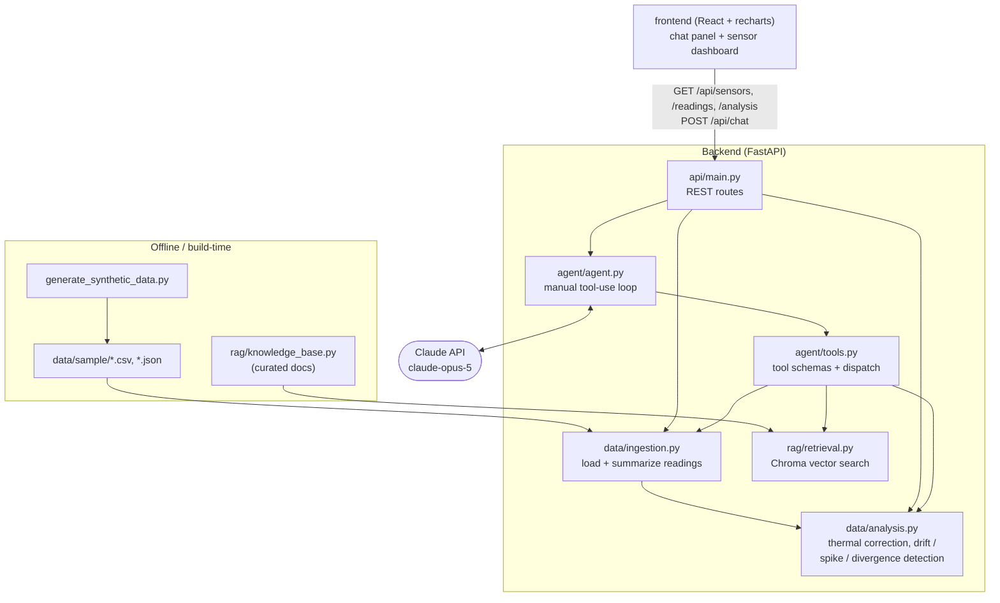
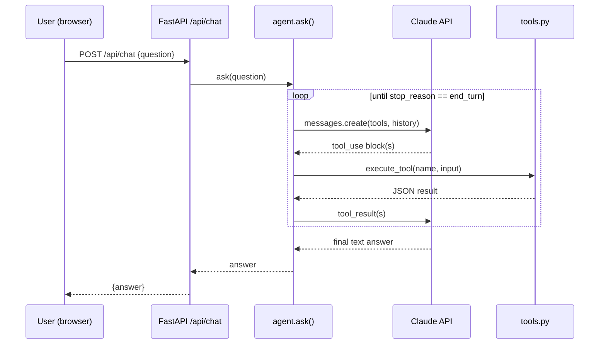

# Architecture

SteelSense AI is five small, independently-testable pieces wired together: a
synthetic data generator, an anomaly-detection pipeline, a RAG knowledge base, a
tool-calling agent, and a thin API/UI on top. Nothing here is a single monolithic
"do everything" module — each stage was built and verified on its own before the
next one was layered on (see the git history), which is also why this doc is
organized the same way.

## Component diagram

## The pieces

**`src/backend/data/generate_synthetic_data.py`** — produces the only data this
project has: 60 days of hourly readings for 8 simulated Hall-effect sensors on a
fictional bridge, with three anomalies deliberately injected (one drift, one spike,
one divergence — see `docs/evals.md` and the module's own docstring for the
modeling detail). Output is checked into `data/sample/`, including a
`scenario_ground_truth.json` answer key used only during development to verify the
detection pipeline actually finds what was injected — the agent never sees it.

**`src/backend/data/ingestion.py`** — loads the CSV/JSON and exposes small
structured summaries (mean/std/min/max/latest/trend), not raw per-timestamp dumps.
This is what a "give me the numbers" query hits.

**`src/backend/data/analysis.py`** — the actual anomaly-detection pipeline, and the
part of this project closest to real signal-processing work. Three steps:

1. **Thermal correction.** Fit `reading_mv ~ temperature_c` over each sensor's
   first 14 days (a commissioning baseline), subtract the predicted thermal
   component from the full series. Every downstream check operates on this
   residual, not the raw reading — otherwise ordinary weather swings would look
   like stress anomalies.
2. **Drift + spike detection**, both expressed in units of the sensor's own
   baseline noise ("sigma") so thresholds scale sensibly across sensors. Spike
   detection specifically uses a *trailing* rolling baseline rather than a fixed
   one, so a slowly growing oscillation (the fatigue signature) doesn't get
   misread as a sequence of spikes — an early version of this pipeline made
   exactly that mistake.
3. **Divergence detection** via each sensor's best-correlated peer over the
   baseline window. This only works because Beam 1A/1B share a real correlated
   "live load" signal in the generator (see below) — the pipeline reports the
   pair's gap growing, and deliberately does **not** claim to know which sensor
   is the one that moved, because a two-sensor pairwise comparison genuinely
   can't determine that without a third reference.

**`src/backend/rag/knowledge_base.py`** — 8 original, hand-written domain summaries
(magnetic sensing principles, fatigue mechanics, SHM practice, diagnostic
heuristics), each with a `source_note` pointing to the general literature it's
informed by. No verbatim text from any source.

**`src/backend/rag/retrieval.py`** — wraps that corpus in an in-memory Chroma
collection, rebuilt fresh on every process start. The corpus is small enough
(8 documents) that this is simpler and more reliable than managing a persisted
index file.

**`src/backend/agent/`** — `tools.py` defines four tools (`list_sensors`,
`get_sensor_summary`, `run_anomaly_detection`, `search_domain_knowledge`) as thin
wrappers around the modules above, plus JSON-schema definitions for Claude's
tool-calling. `agent.py` is a **hand-written** tool-use loop rather than the SDK's
beta tool runner — a deliberate choice for a small, fixed tool set, so the
request → execute-tools → respond cycle has no beta-feature dependency and is easy
to read start to finish. The system prompt requires every anomaly claim to be
backed by `run_anomaly_detection` (not the model's own read of summary stats) and
every physical explanation to cite a named knowledge-base entry.

**`src/backend/api/main.py`** — FastAPI routes with no business logic of their own;
they validate input and call straight into the modules above. `/api/sensors` and
`/api/sensors/{id}/readings` back the dashboard's chart; `/api/analysis` backs the
fleet-status ranking; `/api/chat` wraps the agent loop.

**`src/frontend/`** — a two-panel React dashboard: a chat panel (with the tool loop
running server-side per request) and a fleet-status list + recharts time-series
chart that shades detected spike/drift windows and overlays the peer sensor's line
when divergence is flagged, so the pattern the agent describes in text is also
visible on the chart.

## Request lifecycle: one chat question

A typical query makes 2-4 round trips through that loop (e.g. run the detection
pipeline, then search the knowledge base to explain the result) before Claude
produces a final grounded answer.

## Notable design decisions

- **Manual tool loop over the beta tool runner** — no beta-SDK dependency, and the
  whole control flow fits in one file you can read top to bottom.
- **In-memory Chroma, rebuilt per process** — the knowledge base is 8 documents;
  managing a persisted index would be pure overhead at this scale.
- **Thermal correction before every other check** — arguably the single most
  important modeling decision in `analysis.py`; without it, the pipeline would
  confuse ordinary seasonal temperature drift with structural stress. It's also
  directly reflected in the knowledge base's own `temperature-cross-sensitivity`
  entry, so the pipeline and the domain knowledge it cites are consistent with
  each other.
- **`claude-opus-5` as the default agent model** (configurable via `ANTHROPIC_MODEL`)
  — the eval judge deliberately runs on a *different, cheaper* model
  (`claude-haiku-4-5`) so grading isn't the same model checking its own work.

## Known limitations

- All data is synthetic and clearly labeled as such throughout (`data/sample/README.md`,
  API responses, the UI header, and the agent's own system prompt).
- Cross-sensor divergence only works for Beam 1A/1B, the one pair the generator
  gives a genuinely shared signal to — see the pipeline's own docstring and
  `docs/evals.md` for why that's a deliberate scope decision, not an oversight.
- The eval set is 10 hand-authored queries graded once by an LLM judge, not a
  statistically powered benchmark — see `docs/evals.md`'s limitations section for
  the full honest accounting.
