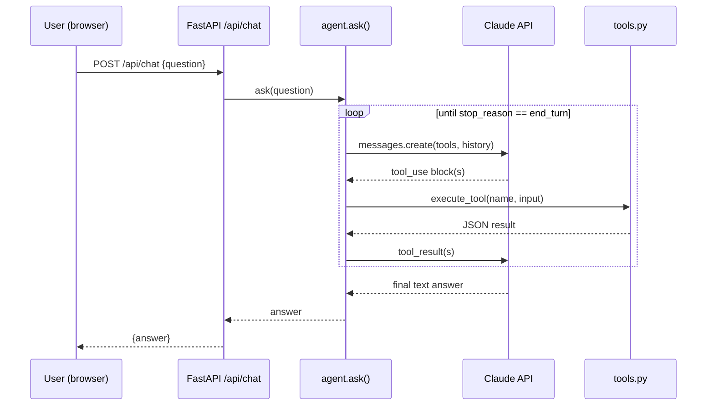
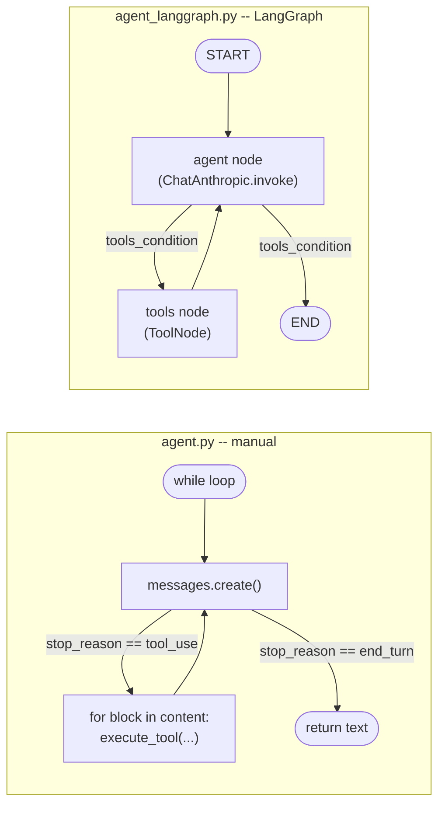

# Architecture

SteelSense AI is five small, independently-testable pieces wired together: a
synthetic data generator, an anomaly-detection pipeline, a RAG knowledge base, a
tool-calling agent, and a thin API/UI on top. Nothing here is a single monolithic
"do everything" module — each stage was built and verified on its own before the
next one was layered on (see the git history), which is also why this doc is
organized the same way.

## Component diagram

## The pieces

**`src/backend/data/generate_synthetic_data.py`** — produces the only data this
project has: 60 days of hourly readings for 8 simulated Hall-effect sensors on a
fictional bridge, with three anomalies deliberately injected (one drift, one spike,
one divergence — see `docs/evals.md` and the module's own docstring for the
modeling detail). Output is checked into `data/sample/`, including a
`scenario_ground_truth.json` answer key used only during development to verify the
detection pipeline actually finds what was injected — the agent never sees it.

**`src/backend/data/ingestion.py`** — loads the CSV/JSON and exposes small
structured summaries (mean/std/min/max/latest/trend), not raw per-timestamp dumps.
This is what a "give me the numbers" query hits.

**`src/backend/data/analysis.py`** — the actual anomaly-detection pipeline, and the
part of this project closest to real signal-processing work. Three steps:

1. **Thermal correction.** Fit `reading_mv ~ temperature_c` over each sensor's
   first 14 days (a commissioning baseline), subtract the predicted thermal
   component from the full series. Every downstream check operates on this
   residual, not the raw reading — otherwise ordinary weather swings would look
   like stress anomalies.
2. **Drift + spike detection**, both expressed in units of the sensor's own
   baseline noise ("sigma") so thresholds scale sensibly across sensors. Spike
   detection specifically uses a *trailing* rolling baseline rather than a fixed
   one, so a slowly growing oscillation (the fatigue signature) doesn't get
   misread as a sequence of spikes — an early version of this pipeline made
   exactly that mistake.
3. **Divergence detection** via each sensor's best-correlated peer over the
   baseline window. This only works because Beam 1A/1B share a real correlated
   "live load" signal in the generator (see below) — the pipeline reports the
   pair's gap growing, and deliberately does **not** claim to know which sensor
   is the one that moved, because a two-sensor pairwise comparison genuinely
   can't determine that without a third reference.

**`src/backend/rag/knowledge_base.py`** — 8 original, hand-written domain summaries
(magnetic sensing principles, fatigue mechanics, SHM practice, diagnostic
heuristics), each with a `source_note` pointing to the general literature it's
informed by. No verbatim text from any source.

**`src/backend/rag/retrieval.py`** — wraps that corpus in an in-memory Chroma
collection, rebuilt fresh on every process start. The corpus is small enough
(8 documents) that this is simpler and more reliable than managing a persisted
index file.

**`src/backend/agent/`** — `tools.py` defines four tools (`list_sensors`,
`get_sensor_summary`, `run_anomaly_detection`, `search_domain_knowledge`) as thin
wrappers around the modules above, plus JSON-schema definitions for Claude's
tool-calling. `agent.py` is a **hand-written** tool-use loop rather than the SDK's
beta tool runner — a deliberate choice for a small, fixed tool set, so the
request → execute-tools → respond cycle has no beta-feature dependency and is easy
to read start to finish. The system prompt requires every anomaly claim to be
backed by `run_anomaly_detection` (not the model's own read of summary stats) and
every physical explanation to cite a named knowledge-base entry.

`agent_langgraph.py` is a second, genuinely equivalent implementation of the same
agent built on LangGraph instead — same four tools, same system prompt, same
default model, different loop-construction mechanism. See **Manual loop vs.
LangGraph** below for the comparison and which one this project actually uses.

**`src/backend/api/main.py`** — FastAPI routes with no business logic of their own;
they validate input and call straight into the modules above. `/api/sensors` and
`/api/sensors/{id}/readings` back the dashboard's chart; `/api/analysis` backs the
fleet-status ranking; `/api/chat` wraps the agent loop.

**`src/frontend/`** — a two-panel React dashboard: a chat panel (with the tool loop
running server-side per request) and a fleet-status list + recharts time-series
chart that shades detected spike/drift windows and overlays the peer sensor's line
when divergence is flagged, so the pattern the agent describes in text is also
visible on the chart.

**`Dockerfile` / `docker-compose.yml`** — the backend is containerized: a two-stage
build (install dependencies into a venv in one image, copy just that finished venv
plus the app code into a clean runtime image) so build tooling and pip's cache
never ship, running as a non-root user with secrets read from the environment at
container start rather than baked into a layer. This isn't required to run the
project (the venv setup works fine on its own), but it buys three things a
from-source setup doesn't: portability (no "works on my machine" Python-version or
OS-level dependency drift), an environment that matches what most real deployment
targets actually run (Railway's own build is closer to this than to a bare venv),
and a build that's reproducible from a clean slate rather than accumulating local
state over time. See the README's **Backend, with Docker** section for the exact
commands and what was verified end-to-end.

## Request lifecycle: one chat question

A typical query makes 2-4 round trips through that loop (e.g. run the detection
pipeline, then search the knowledge base to explain the result) before Claude
produces a final grounded answer.

## Notable design decisions

- **Manual tool loop over the beta tool runner** — no beta-SDK dependency, and the
  whole control flow fits in one file you can read top to bottom.
- **In-memory Chroma, rebuilt per process** — the knowledge base is 8 documents;
  managing a persisted index would be pure overhead at this scale.
- **Thermal correction before every other check** — arguably the single most
  important modeling decision in `analysis.py`; without it, the pipeline would
  confuse ordinary seasonal temperature drift with structural stress. It's also
  directly reflected in the knowledge base's own `temperature-cross-sensitivity`
  entry, so the pipeline and the domain knowledge it cites are consistent with
  each other.
- **`claude-opus-5` as the default agent model** (configurable via `ANTHROPIC_MODEL`)
  — the eval judge deliberately runs on a *different, cheaper* model
  (`claude-haiku-4-5`) so grading isn't the same model checking its own work.
- **Single uvicorn process in the container, no gunicorn worker pool** — the RAG
  knowledge base and analysis caches are built in-process
  (`agent/tools.warm_up`); N gunicorn workers would each hold their own copy of
  that in-memory state rather than share one, which isn't a win at this app's
  traffic scale. Worth revisiting if this ever needed to handle real concurrent
  load.

## Manual loop vs. LangGraph

`agent.py` and `agent_langgraph.py` are genuinely equivalent, not one real
implementation and one toy comparison: same four tools (both call the identical
`tools.execute_tool` dispatcher — the LangGraph version's `@tool`-decorated
wrappers are a thin adapter, not a reimplementation), same `SYSTEM_PROMPT`, same
default model, same 10-query eval set. Switch between them with
`AGENT_IMPLEMENTATION=manual|langgraph` (see `api/main.py`), or run either
directly: `python -m src.backend.agent.agent "<question>"` vs.
`python -m src.backend.agent.agent_langgraph "<question>"`.

**What LangGraph genuinely does for you:**

- **The tool-execution dispatch loop.** `ToolNode` matches each tool call in the
  model's response to the right Python function by name, invokes it, and formats
  the result as a `ToolMessage` -- the exact bookkeeping `agent.py`'s manual
  `for block in response.content: if block.type == "tool_use"` loop does by hand.
- **Conditional routing as data, not control flow.** `add_conditional_edges` +
  `tools_condition` express "loop back if there are tool calls, otherwise stop"
  declaratively. The manual version expresses the identical logic as an
  `if response.stop_reason == "tool_use"` branch -- same decision, different
  shape (a graph edge vs. an `if` statement).
- **Recursion safety built in.** `recursion_limit` + `GraphRecursionError` is the
  same guard `agent.py`'s hand-rolled `MAX_TOOL_ITERATIONS` counter provides, just
  provided by the framework instead of written once and reused.
- **A message-state reducer.** `MessagesState`'s `add_messages` annotation
  handles appending new messages to the conversation automatically; the manual
  version does the equivalent with explicit `messages.append(...)` calls.

**What's roughly equivalent, just expressed differently:**

- **Tool schemas.** LangChain's `@tool` decorator infers the JSON schema Claude
  needs from type hints and the docstring; `tools.py`'s `TOOL_DEFINITIONS` writes
  that same schema by hand as a dict. Same information, different authoring
  ergonomics -- neither is more capable than the other here.
- **System prompt handling.** Both just hand Claude one string.
- **Business logic and grounding quality.** Identical, by construction -- both
  call the same tools, so both are checked against the same eval set for a fair
  comparison, not just "both compile."

**A real cost this comparison surfaced, not a hypothetical one:** adding
LangGraph forced `anthropic` down from `1.0.0` to `0.125.0` project-wide
(`langchain-anthropic` hard-requires `anthropic<1.0.0`), and pulled in three
small native-extension dependencies (`uuid_utils`, `xxhash`, `orjson`, needed
only for LangSmith tracing and the hosted LangGraph Platform client -- neither of
which this project uses) that needed a defensive shim
(`_native_ext_shims.py`) to work around a Windows security policy on the
development machine. None of that is a LangGraph *bug* -- it's the real,
concrete shape of taking on a framework's dependency surface, and it's the kind
of cost that's invisible until you actually do the integration rather than just
read about it.

**Eval results:** manual 10/10 queries fully passed; LangGraph 9/10 (see
`evals/results.json` vs. `evals/results_langgraph.json`). The one LangGraph miss
was `concept-drift-vs-spike`, where the judge dinged an otherwise well-grounded
answer for citing an additional, properly-sourced knowledge-base entry (sensor
hysteresis) that went slightly beyond what the question asked -- not a
hallucination, just broader scope than the checklist wanted. Not a meaningful
quality gap between the two agents; both are working correctly.

**Which one this project actually uses, and why:** the manual loop is the
default (`AGENT_IMPLEMENTATION=manual`), and I'd genuinely choose it here, not
just because it's what shipped first. SteelSense AI's agent is a linear
loop over four tools with no branching beyond "call a tool or don't," no
multi-turn memory across requests, and no multi-agent orchestration --
which means this project uses almost none of what LangGraph actually buys you
(checkpointed state across sessions, human-in-the-loop interrupts, subgraphs,
built-in visualization/streaming of a genuinely complex graph). Against that,
the manual version is ~100 lines with a single dependency, its stack traces
point at this project's own code rather than framework internals, and there's no
version-compatibility surface to manage. I'd reach for LangGraph the moment the
agent's actual shape needed one of those things -- e.g. persisted conversation
memory across sessions, a second specialized subagent, or a step that pauses for
human approval before running -- because at that point the graph earns the
dependency instead of just hosting an equivalent-but-costlier version of a loop
four tools don't need framework support to manage.

## Known limitations

- All data is synthetic and clearly labeled as such throughout (`data/sample/README.md`,
  API responses, the UI header, and the agent's own system prompt).
- Cross-sensor divergence only works for Beam 1A/1B, the one pair the generator
  gives a genuinely shared signal to — see the pipeline's own docstring and
  `docs/evals.md` for why that's a deliberate scope decision, not an oversight.
- The eval set is 10 hand-authored queries graded once by an LLM judge, not a
  statistically powered benchmark — see `docs/evals.md`'s limitations section for
  the full honest accounting.
- The Docker setup has been verified end-to-end: `docker compose up --build`,
  then `/api/health`, `/api/sensors`, `/api/analysis`, and a full `/api/chat`
  round trip all confirmed working against the running container. An earlier
  version left the RAG embedding-model download to happen at container startup;
  real testing caught that this made a cold container's first boot take ~70s
  before it would answer *any* request (including a health check), which is easy
  to mistake for the app being broken -- fixed by pre-fetching that model at
  build time instead (see the Dockerfile).
- `anthropic` is pinned below 1.0.0 project-wide because `langchain-anthropic`
  requires it -- a real constraint from adding the LangGraph comparison, not a
  choice either agent implementation would otherwise make. The manual agent was
  re-verified end-to-end on the downgraded version before accepting the pin.
  `_native_ext_shims.py` similarly exists only because of a Windows security
  policy on the development machine, not a real portability requirement -- it's
  a no-op (confirmed via try/except around each real import) anywhere that
  policy doesn't apply, including the deployed Railway backend.
